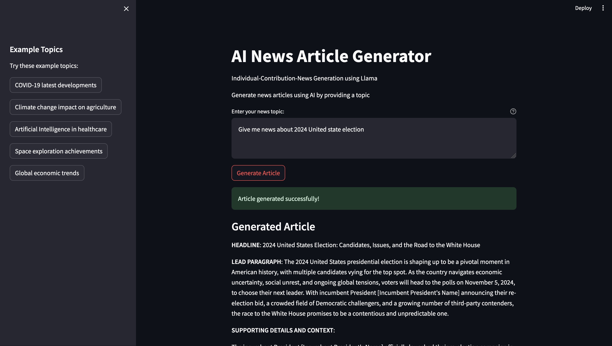

## Hi, 👋 I’m Modupeola Fagbenro, can't pronounce my name? 😄 - call me Gold 👩‍💻
  
 | 

### 💁 About Me:
- 👀 I’m interested in Data Analysis, Data Science, Machine learning, BI Engineer, Big Data, Cloud Computing
- 🌱 Working with python programming language, SQL , Machine learning-Natural Language Processing, Deep learning
- ✍️ I write about Data Science; my blog is https://medium.com/@Gold31
- 📙 Currently learning everything
- 📖 Exploring: Deep Learning, Advanced Natural Language Processing, GenAI
- 🤝 I’m looking to collaborate on Data science/ML knowledge sharing
- 😄Fun Fact: Eat🥫🔃 ➡code👩‍💻🔃 ➡sleep🛌🔃 ➡repeat🔃

### 💻 🧰 🛠️ Expertise:
- 📊 Data Analysis & Advanced Visualization
- 🤖 Machine Learning Implementation:
  - Deep Learning
  - Natural Language Processing
- 💹 Business Intelligence Solutions
- 📈 Statistical Modeling & Predictive Analytics
-  ☁️ Big Data & Cloud Computing

### ✉️ Find me on:

    
    
    
    
    

 

### 🧰 💻 Languages and Tools:

  
     
    

### 📘 Blog Posts
<!-- BLOG-POST-LIST:START -->
<!-- BLOG-POST-LIST:END -->

### ML-Project Deployed -AI-News-Article-Generator

### 🏅 My Github Stats
 | 

<!---
Modupeolawuraola/Modupeolawuraola is a ✨ special ✨ repository because its `README.md` (this file) appears on your GitHub profile.
You can click the Preview link to take a look at your changes.
--->

